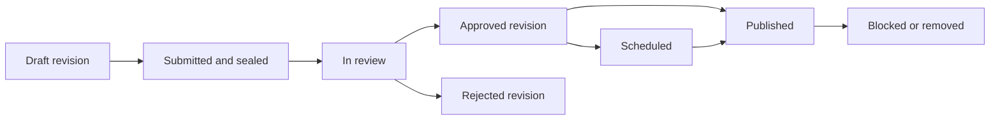

# Phase 5 Slice 1 — Content model and access-rule design

Date: September 8, 2026. Status: local design draft; human technical review pending.
September 9 direction: use this design for the first functioning test-content
path, pairing implementation with provider/founder decisions and targeted review.
The cancelled CCBill clarification is not a development prerequisite. This
direction supersedes the earlier design-only next-step restriction; the design
itself still contains no implementation or live-use approval.
Baseline: `3dfad3a`, following the published engineering checkpoint `8c33fd1`.

## Purpose and authorized scope

The founder authorized starting P05 after the recommendation to prepare this
bounded design slice. This record specifies content identities, lifecycle,
access decisions, synthetic cases, and the P04/P06 integration boundaries.
It is a proposed engineering design, not an implemented backend or completed
Phase 5. Names below are proposed domain concepts, not existing Prisma models
or exported contracts.

The [roadmap](../../PLAN.md#9-phase-5--media-pipeline-and-content-model),
[business definition](../product/initial-business-definition.md), and
[handoff](../../HANDOFF.md) remain authoritative. This design began while the
CCBill reply and Maryland formation approval were pending. On September 9 the
founder supplied CCBill's initial intake reply; model approval, pricing and the
detailed review-site scope still need clarification. Maryland approval remains
pending. This local design preparation retains its originally authorized scope.
Targeted human review accompanies the relevant design/code slice under the
updated PLAN §20 before live protected-media, money or identity use. No provider purchase,
credentials, upload endpoint, migration, payment, role promotion, public
exposure, or private-operations activation is part of this slice.

## Existing integration seams

| Area                     | Existing evidence                                                                                                                     | Consequence for P05                                                                                                                                       |
| ------------------------ | ------------------------------------------------------------------------------------------------------------------------------------- | --------------------------------------------------------------------------------------------------------------------------------------------------------- |
| Identity and preferences | `User`, `Session`, `UserPreference` in `packages/database/prisma/schema.prisma`; real auth/preference routes in `apps/api/src/app.ts` | Read current account/session state and default-hidden explicit preference on the server. An opt-in is not age verification.                               |
| Creator applications     | `CreatorApplication` and append-only acceptance/review evidence; `apps/api/src/routes/creatorApplications.ts`                         | Applications persist pending. An enum named `APPROVED`, a seeded `CREATOR`, or a decorative verified badge does not establish a working approval process. |
| Background processing    | [Phase 2 worker](phase2-worker-foundation.md)                                                                                         | PostgreSQL job intent, leases, and fencing exist for a fixed canary only. Media job kinds, payloads, permissions, and handlers do not exist.              |
| Feed and profile         | `apps/web/src/fixtures/homeFeed.js`, `profile.js`; Home/Profile local unlock state                                                    | Demo URLs, `locked`, and `mediaCount` are presentation samples. Replace them through real contracts during later integration.                             |
| Store                    | `apps/web/src/fixtures/storeContent.js`; `StorePage.jsx`                                                                              | Float prices, tier labels, free follows, paid subscriptions, and download flags are samples. They do not settle entitlement or refund policies.           |
| Chat                     | `apps/web/src/components/ChatSidebar.jsx`                                                                                             | Local text messages only; no durable conversation membership, PPV attachment contract, or WebSocket backend.                                              |
| Contracts/API            | `packages/contracts/src/index.ts`; `apps/api/src/app.ts`                                                                              | There are no content/media/purchase endpoints or content models to extend today. New implementation must use TypeScript and Zod.                          |

Audio, download flags, and legacy moment behaviors appearing in fixtures do not
expand this slice. The initial design covers individual photos/videos and
bundles, offered in feed, Store/profile, or locked chat. Connect service orders,
real-time messaging, and tipping remain required in their owning phases; they
must not be represented as media purchases to avoid their own fulfillment/refund
rules. Proposed live/off-platform service delivery still needs its commercial
and operational requirements; this design adds no calling or streaming feature.

## Proposed domain model

Separate the work a creator publishes, the files it contains, the offer a
member buys, and the surface displaying that offer.

| Concept                    | Minimum proposed data and relationships                                                                                                                              | Authority and constraints                                                                                                                                                             |
| -------------------------- | -------------------------------------------------------------------------------------------------------------------------------------------------------------------- | ------------------------------------------------------------------------------------------------------------------------------------------------------------------------------------- |
| `Content`                  | Opaque ID, owner user ID, current published revision ID, availability, access generation, created/updated timestamps                                                 | Stable identity across surfaces. Ownership cannot be reassigned through a content edit. Block/removal overrides every revision.                                                       |
| `ContentRevision`          | Content ID, revision number, caption/title, audience rule, explicit classification, lifecycle, optional scheduled time, evidence references, version for concurrency | A draft may change. Submission seals its text, audience, classification, and asset manifest. Changes require a new revision and review. Unique `(contentId, revisionNumber)`.         |
| `MediaAsset`               | Opaque ID, owner, upload-intent ID, media kind, validation state, immutable sealed-source reference, verified digest/size/type, access generation                    | Storage references are private server data. No client-supplied arbitrary URL or storage path. Original bytes are never overwritten after sealing.                                     |
| `MediaVariant`             | Asset ID, source digest, transformation version, purpose, private object reference, validation/moderation state, dimensions/duration                                 | Distinguish protected renditions from separately reviewed teaser artwork. A thumbnail is not automatically safe or public.                                                            |
| `RevisionAsset`            | Revision ID, asset ID, position                                                                                                                                      | Ordered, nonempty manifest for media content. Unique asset and position within a revision; all assets belong to its creator. Enforce ownership in the database/service transaction.   |
| `UploadIntent`             | Owner, asset ID, operation idempotency digest, server-chosen quarantine reference, declared limits, expiry, reserved quota, expected state/version                   | Controls one upload attempt. Completion checks storage independently and queues validation atomically. Declared values never substitute for measured bytes.                           |
| `OfferVersion`             | Stable offer ID, immutable version ID, creator/content revision, exact asset manifest, audience/recipient scope, P06 price/terms reference, sale availability        | One photo/video or a bundle. Buying revision 1 never silently buys revision 2. Closing sales does not itself erase a prior grant. Monetary policy and settlement remain P06.          |
| `ContentPlacement`         | Revision/offer-version ID, surface (`FEED`, `STORE`, `CHAT`), publication state; conversation/recipient reference for chat                                           | Presentation only. Private chat scope is never inferred from possession of a message ID. Reusing an offer on another surface must preserve its scope.                                 |
| Content lifecycle evidence | Actor/service identity, target and version, action, previous/new state, reason code, timestamp, request ID                                                           | Append-only decision history. Separate restricted evidence from member-visible metadata; no identity files, signed URLs, or credentials in events. Retention remains reviewed policy. |

P04 owns creator eligibility, applicable agreement versions, performer/consent
records, and authorized moderation decisions. P05 stores opaque references to
the evidence applicable to an exact content revision and its assets; it does
not copy identity documents or treat a creator checkbox as completed review.
Every required performer must be covered for every applicable asset. Revoked
or missing evidence blocks publishing and delivery where that evidence is
required. The evidence resolver must support `UNKNOWN`, which never grants.

P06 owns subscription state, immutable purchase/ledger evidence, and entitlement
grant/revocation records. Two distinct authoritative read inputs are proposed:

- Subscription facts identify the member, creator, canonical tier, effective
  access period, and current restriction/revocation state. They apply to the
  creator's currently published qualifying content without copying a PPV grant
  for each new post. P06 owns how billing events establish that access period.
- PPV grants identify the member, creator, exact offer version and covered
  revision/assets, recipient scope, effective time, expiry, and revocation
  state. P05 validates those matches against the requested asset.

P05 never accepts a client `purchased` field or grants access by changing a
wallet number. Member Veso and creator earnings remain separate append-only
ledgers. No permanent-access promise or decimal Veso policy is introduced here.

Draft deletion and storage cleanup cannot cascade-delete legal, moderation, or
purchase evidence. Logical removal and physical retention are separate actions.

If one required bundle asset becomes restricted, the conservative proposal
blocks that referencing revision as a whole. Do not silently fulfill a purchased
bundle with fewer assets or substitute another file. P06 resolves any refund or
remaining-access treatment through reviewed policy and evidence.

## Lifecycle and concurrency

Audience and lifecycle are different fields. `SCHEDULED`, `DRAFT`, `REMOVED`,
and `QUARANTINED` must not share an enum with subscriber or PPV access rules.



The diagram shows the successful editorial path. Validation failures stop
before review. A restriction can block content at any stage, including all old
published revisions. Rejection is terminal for that revision; corrections
create a new draft. Restoration requires a separately authorized, audited
transition with current evidence; a delayed worker cannot restore content.

| Transition                  | Required checks and atomic effect                                                                                                                                                                                                                  |
| --------------------------- | -------------------------------------------------------------------------------------------------------------------------------------------------------------------------------------------------------------------------------------------------- |
| Request upload              | Current session, verified active creator, P04 eligibility, permitted type and quota. Reserve quota and record intent transactionally before issuing any upload capability.                                                                         |
| Confirm upload              | Owner and unexpired intent, expected state, storage object presence/size checks. Seal the exact input snapshot, then commit validation intent and domain state in PostgreSQL together. Repeated identical completion returns the original outcome. |
| Validate/process            | Verify actual file signature/decodability and measured size; malware checks and bounded resource use; create variants from sealed bytes. Missing checks, timeout, or worker outage leave content unavailable.                                      |
| Submit revision             | Owner, current creator eligibility, all manifest assets ready, applicable consent references and versioned publishing acknowledgement. Freeze the revision and enqueue required review work in the same transaction.                               |
| Approve/reject              | Future authorized operations principal plus exact permission, current evidence, and expected revision state. Commit decision and audit event together. A media scanner cannot grant editorial approval.                                            |
| Publish or release schedule | Approved exact revision and every asset, current creator/evidence eligibility, allowed placement/audience, and authoritative time at or after schedule. Compare expected content version and update the published pointer with evidence.           |
| Remove/restrict             | Authorized action increments the affected content/asset access generation, blocks discovery and future grants, and records evidence with durable delivery-invalidation work. A removed shared asset blocks every referencing revision.             |

All consequential mutations use a scoped idempotency key bound to actor,
operation, and canonical payload. Reusing a key with a different payload is a
conflict, not a second effect. Expected-version transactions serialize edits,
publish, removal, and review; affected creator/evidence/grant state must be
reauthorized at the commit/access boundary, not solely when a screen opens.
Use authoritative server/database time and explicit UTC timestamps. A schedule
does not publish early, and a resumed worker rechecks every gate before release.

The worker's existing canary allowlist is not a general media queue. A later
slice must add bounded versioned payloads containing IDs only, least-privilege
object/database access, transactional enqueue, idempotent output registration,
lease fencing, and recovery tests. Storage writes cannot join a PostgreSQL
transaction: outputs use unique staging references and become deliverable only
after the final fenced database commit. Orphans remain private until separately
authorized cleanup. A lost lease cannot publish a rendition or overwrite a
winning worker's output.

## Access rules

Every request first resolves the current resource and its real server-owned
identity. A proposed access evaluator returns `HIDDEN`, `LOCKED`, `ALLOWED`, or
`UNAVAILABLE`; internal reasons stay out of responses that would reveal hidden
objects. These decisions are request-time results, not durable entitlement rows.

Apply the following gates in order:

1. Validate current session/account and the applicable member age/country
   eligibility. Unknown eligibility denies. The existing signup attestation is
   not substituted for an unimplemented age-assurance requirement.
2. Resolve content, requested revision, asset, placement, and recipient scope.
   Ordinary audience reads resolve only the current published revision.
   Historical revision delivery requires a retained exact PPV grant as defined
   below. An asset ID must be in that authorized revision/offer manifest. A chat
   participant may see only the placement/offer intended for that participant.
3. Require published, available, approved content and a ready, approved asset,
   with currently applicable creator/performer evidence. Block, removal,
   quarantine, expired scope, and unknown evidence override every paid grant.
4. Apply explicit classification to text, previews, variants, and originals.
   Explicit material is hidden when the persisted preference is absent/false.
   Unknown classification is hidden. Payment never enables the preference.
5. Evaluate the audience/grant rule below using durable server data. Following
   is distinct from a paid subscription. Inspect subscription period and
   revocation, not a saved UI label.
6. Immediately before delivery, validate current restrictions, generations and
   grant validity again. Do not cache an allow decision across users or serve
   protected bytes from an unauthenticated shared cache.

| Proposed audience rule | Additional requirement after all common gates                                                                                                                                          |
| ---------------------- | -------------------------------------------------------------------------------------------------------------------------------------------------------------------------------------- |
| `PUBLIC`               | No follow, subscription, or purchase required. Synthetic cases use an eligible authenticated member; anonymous access is an unresolved launch-policy decision, not implicitly enabled. |
| `FOLLOWERS`            | Current follow relationship to this creator.                                                                                                                                           |
| `SUBSCRIBERS`          | Current qualifying subscription to this creator, within the effective access period.                                                                                                   |
| `TIER`                 | Current subscription whose canonical tier ID is in an explicit allowed set. Tier names/ranks in fixtures do not establish inheritance.                                                 |
| `PPV`                  | Active durable grant for this member and the exact offer version and requested asset.                                                                                                  |

Each revision has one explicit rule in this first design. Whether subscriber
access and PPV are alternatives or cumulative requirements is unresolved.
Unsupported combinations deny rather than inventing an OR/AND policy. A future
combined rule must define the business policy and corresponding test matrix.
Expiration denies at `now >= expiresAt`; no grace interval is invented. P06
will supply reviewed grace/cancellation rules if the agreed product needs them.

An existing purchase can reference an older published revision even when the
creator publishes a new one. That old revision remains subject to current
restrictions and its exact grant's terms. A historical grant permits only its
member and covered assets; the prior revision's `PUBLIC`, follower, or subscriber
rule cannot authorize anyone else. Ordinary discovery and new offer issuance
target the current published revision; superseded placements/offers become
unavailable for new sales while existing receipt-based access resolves retained
grants. Historical subscription access would need a separately reviewed policy.
An unpublished revision cannot become accessible merely by inserting a synthetic
purchase record.

Discovery and delivery are separate permissions. An otherwise eligible member
may see a reviewed teaser for a `LOCKED` offer; preview eligibility and placement
scope must pass independently. Lists, counts, search, and notifications must
exclude hidden material on the server before pagination or aggregation. Error
responses for missing/inaccessible resources use the same public not-found
shape; detailed reasons are reserved for appropriately authorized diagnostics.
Required dependency failure returns a retryable unavailable outcome with no
asset or storage details.

Creators may read their own draft metadata through a distinct owner operation.
Owner status does not grant public publication or member access. Serving draft
bytes and sensitive moderation previews needs a separately reviewed route,
permissions and audit design; it is not an `ADMIN` or ownership bypass inside
the member delivery evaluator.

## Response boundaries and cross-surface examples

Future list/card contracts allow only member-safe metadata: content/revision
IDs, creator summary, approved text, reviewed teaser reference if permitted,
counts derived from the authorized manifest, audience label, and optional
offer-version reference. They exclude private object paths, originals, signed
delivery URLs, identity evidence, hidden captions, and moderation notes.

A delivery request identifies content/revision, asset, permitted variant, and
placement/offer context. The server resolves storage; the client cannot pass a
URL to sign. Successful future delivery responses are private and non-cacheable
and expose only the specific temporary capability and its expiration. No such
endpoint or capability is implemented by this document.

These mnemonic IDs and outcomes are synthetic specification examples, not
seed data, real API responses, or proof that the rules are implemented:

```json
{
  "contentId": "sample-content-1",
  "revisionId": "sample-revision-1",
  "offerVersionId": "sample-offer-v1",
  "assetIds": ["sample-photo-1", "sample-video-1"],
  "surfaces": ["FEED", "STORE"],
  "audience": "PPV"
}
```

Member A's future confirmed purchase grants those two assets through either
authorized surface. A client unlock click grants nothing. A later offer v2
adding `sample-photo-2` does not add that asset to A's v1 grant.

A chat-only offer uses another scoped offer version, linked to a durable
conversation and intended recipient. Member B cannot discover or purchase A's
chat offer by guessing its ID. Grant scope records the recipient; neither
forwarding a message nor copying its attachment reference broadens access.
P09 must define conversation closure/block behavior before integration. If
current recipient/conversation eligibility cannot be resolved, delivery denies.

## Upload and removal design constraints

The existing roadmap names private R2 storage. This slice leaves the adapter
unimplemented and does not select Cloudflare Access as an operations provider.
Client uploads may target only server-chosen quarantine objects. Uploaded
filenames and MIME declarations are untrusted. Validation must use an allowlist,
actual byte inspection, decoder limits, size/quota checks, isolated processing,
and malware checks before derivatives enter review. Detailed type/size limits
and scanning vendors remain implementation inputs. This layered approach
follows [OWASP's upload guidance](https://cheatsheetseries.owasp.org/cheatsheets/File_Upload_Cheat_Sheet.html).

R2 documents that presigned URLs are bearer capabilities and can be reused
until expiration. Consequently, a browser completion call does not consume a
PUT capability. The later adapter must seal a private immutable snapshot and
ensure validation, transformation, review, and delivery all refer to those same
bytes; a retry must not replace an already reviewed object. The exact snapshot
mechanism needs a storage spike before uploads are implemented.
[R2 presigned URL documentation](https://developers.cloudflare.com/r2/api/s3/presigned-urls/).

Similarly, stopping new URL issuance alone is insufficient to satisfy the
roadmap's removal requirement. Proposed delivery uses a short-lived,
session-bound application capability with authorization/restriction checks on
each fetch, backed by private storage. A direct object bearer URL cannot be
treated as session-bound merely by associating it with a user in PostgreSQL.
The technical review must settle gateway, range requests, cache behavior,
in-flight transfer interruption, and revocation latency before implementation.
Until that mechanism passes a takedown test, protected delivery stays disabled.
Already downloaded bytes cannot be recalled. This is a design limitation, not
a promise of DRM or instant erasure on a member's device.

## Synthetic acceptance matrix for later implementation

Unless overridden, examples use an active, verified, eligible member, current
approved creator/evidence, a published revision with approved ready assets,
valid placement scope, and server time. These are planned tests, not executed
backend tests. Positive cases use explicit synthetic eligibility facts; such
facts must never become a production fallback for missing P04/P06 integrations.

| Case | Change to baseline                                                              | Expected result                                                                                                                                      |
| ---- | ------------------------------------------------------------------------------- | ---------------------------------------------------------------------------------------------------------------------------------------------------- |
| A01  | `PUBLIC`, non-explicit                                                          | Member may read the permitted rendition; list payload still has no protected URL.                                                                    |
| A02  | `FOLLOWERS`, no follow                                                          | Locked teaser only if separately allowed; bytes denied.                                                                                              |
| A03  | `FOLLOWERS`, current follow                                                     | Allowed; this does not create a subscription.                                                                                                        |
| A04  | `SUBSCRIBERS`, follow only or expired subscription                              | Denied.                                                                                                                                              |
| A05  | `SUBSCRIBERS`, current subscription to exact creator                            | Allowed.                                                                                                                                             |
| A06  | `TIER`, subscription to different creator or tier outside allowed set           | Denied, regardless of matching display name.                                                                                                         |
| A07  | `PPV`, browser says purchased or checkout redirected successfully               | Denied without a durable active P06 grant.                                                                                                           |
| A08  | `PPV`, active grant covering requested v1 asset                                 | Allowed from any placement permitted by the grant's scope.                                                                                           |
| A09  | Grant for another member, another offer version, or an asset outside its bundle | Denied.                                                                                                                                              |
| A10  | Explicit revision; preference missing/false, including a paying member          | Hidden from lists, counts, metadata and bytes; optional neutral receipt remains P06.                                                                 |
| A11  | Explicit preference true, but age/country eligibility unknown                   | Denied.                                                                                                                                              |
| A12  | Classification or required performer/creator evidence unknown/revoked           | Hidden; no signed delivery capability.                                                                                                               |
| A13  | Draft, scheduled for the future, rejected, quarantined, or removed              | Denied to members, even with a purchase or creator role.                                                                                             |
| A14  | Creator loses approval or is suspended/banned                                   | Publishing and new delivery deny under this conservative proposal; paid-access consequences require reviewed policy.                                 |
| A15  | Recipient B requests A's private chat offer/message                             | Not found to B; neither teaser nor purchase is available.                                                                                            |
| A16  | Member session revoked or account suspended after card render                   | New delivery denies. Cached UI state cannot authorize.                                                                                               |
| A17  | Grant expiry equals current time; refund/chargeback has revoked grant           | Denied. No implicit grace or recreated entitlement.                                                                                                  |
| A18  | Replay upload completion; then reuse key with different payload                 | First outcome reused; changed payload conflicts. Exactly one validation intent.                                                                      |
| A19  | Wrong-owner asset, empty/duplicate bundle manifest, caller-supplied object path | Reject before recording a valid revision or signing anything.                                                                                        |
| A20  | PUT replay changes quarantine bytes after completion                            | Sealed source remains unchanged; changed input never substitutes for reviewed bytes.                                                                 |
| A21  | Worker crashes, retries, or loses lease while producing variants                | No duplicate deliverable effect; stale worker cannot finalize or republish.                                                                          |
| A22  | Removal races publication, media processing, or URL delivery                    | Removal blocks subsequent fetches across variants, ranges and placements; stale work cannot restore availability. Transport behavior must be proven. |
| A23  | Creator edits bundle after a v1 purchase                                        | v1 manifest unchanged; new revision needs review; v2 assets are not granted to v1 buyer.                                                             |
| A24  | Required database/evidence service unavailable, including during scheduling     | Unavailable/deny with no bytes; recoverable work remains pending.                                                                                    |
| A25  | Another member reuses a valid application delivery capability                   | Denied by session/recipient binding; bearer storage URLs are not exposed as a substitute.                                                            |
| A26  | Removed shared asset remains linked to another revision or old purchase         | Every path to that asset denies; evidence and purchase history are preserved.                                                                        |
| A27  | A public v1 is replaced by PPV v2; a member requests v1 using its old ID        | Ordinary access to v1 denies. Only a retained exact purchase grant may authorize historical bytes under its terms.                                   |
| A28  | Creator publishes a new subscriber post during a member's valid subscription    | Current subscription facts authorize the qualifying current revision without per-post PPV grants.                                                    |

## Review inputs and next implementation boundary

These unresolved inputs belong to the existing sequential workflow, not a new
batch of founder assignments:

| Input                                                                       | Owner/dependency                                                         | Implementation consequence                                                                                                |
| --------------------------------------------------------------------------- | ------------------------------------------------------------------------ | ------------------------------------------------------------------------------------------------------------------------- |
| Anonymous discovery, member eligibility and country policy                  | P04 and reviewed pilot requirements                                      | `PUBLIC` cannot bypass unresolved eligibility; synthetic authenticated behavior is provisional.                           |
| Tier inheritance; PPV versus subscription combinations; download rights     | Product/P06, informed by processor scope                                 | Use explicit rules only; no prototype price/tier/download flag becomes policy.                                            |
| Purchase duration, refunds, suspension, creator removal and chat closure    | P04/P06/P09 reviewed terms and workflow                                  | Grants must encode settled scope and revocation behavior; no lifetime-access promise.                                     |
| Identity/performer evidence and moderation authority                        | P04                                                                      | No real uploads/publishing before the necessary provider, policy and operational requirements exist.                      |
| File limits, scanning, source sealing, delivery revocation, audit/retention | Scoped human technical review and applicable legal/provider requirements | Resolve mechanisms before storage/migration/route implementation; no raw-media or sensitive-data vendor is selected here. |
| Durable media worker and private staging operations                         | P02/P05                                                                  | Add actual domain handlers and failure/recovery proof; a canary success is not media-pipeline evidence.                   |

The next engineering milestone is the first functioning test-creator content
and member-read flow, using safe sample media and the existing UI. It includes
persisted metadata, private media handling and server access rules, paired with
storage/provider setup and targeted review. Tests should prove persistence,
draft privacy and unauthorized access denial. This is planned implementation,
not a completed result of this design. Live creator eligibility, money and
sensitive-data controls remain at their applicable boundaries.

Before any full P05 completion claim, prove the roadmap exits with real
integrations: an approved creator publishes; an unauthorized member cannot
retrieve protected originals; subscriber/PPV access is enforced; and removed
content cannot be delivered. P04 and P06 remain partial/not started as recorded
in the tracker. This document provides the design and planned test cases only.
